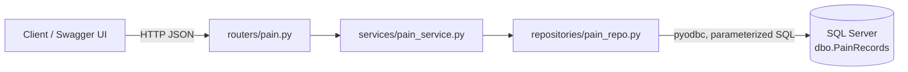

# my-qa-app

A REST API for recording and analysing patient pain data, built with **FastAPI** on **SQL Server**.
It covers the full record lifecycle (create, read, partial update, soft delete) with filtering, sorting,
paging and a summary-statistics endpoint. Swagger UI is included as the interactive client.


## Features

- **CRUD for pain records:** patient name, country, pain level (0–10), pain location, when it occurred, notes
- **Filtering and paging:** by country, location, patient name, pain range and date range, with whitelisted sort columns
- **Statistics:** record count plus average, median, min and max pain level, and the earliest and latest dates, using the same filters
- **Strict validation:** unknown fields rejected, no future dates, strict integer pain levels, whitespace trimmed
- **Consistent JSON envelope:** `{ success, data, meta }` on success, `{ success: false, error: { code, message, details } }` on failure
- **Safe SQL:** every value is a parameter, and no user input is concatenated into SQL
- **Soft delete:** deleted records are hidden from the API but kept in the database

## Architecture



| Layer          | Responsibility                                          |
|----------------|---------------------------------------------------------|
| `routers/`     | HTTP endpoints, request parsing, response models        |
| `services/`    | Business rules, transactions, not-found handling        |
| `repositories/`| SQL queries only                                        |
| `schemas.py`   | Pydantic validation and response shapes                 |
| `errors.py`    | Maps every exception to the standard error envelope     |

## Repository layout

```
my-qa-app/
├── README.md              ← you are here
└── backend/               ← FastAPI service
    ├── app/               ← application code
    ├── sql/               ← table creation + seed scripts
    ├── .env.example       ← configuration template
    ├── requirements.txt
    └── README.md          ← full API reference
```

## Quick start

**Prerequisites:** Python 3.12, SQL Server 2017+ (Express or Developer edition works),
[ODBC Driver 17 for SQL Server](https://learn.microsoft.com/sql/connect/odbc/download-odbc-driver-for-sql-server),
and `sqlcmd`.

```powershell
git clone https://github.com/pritpalkaur/my-qa-app.git
cd my-qa-app\backend

# 1. Install dependencies
python -m venv .venv
.\.venv\Scripts\python -m pip install -r requirements.txt

# 2. Create the table (WARNING: drops dbo.PainRecords if it exists)
sqlcmd -S <server> -U <user> -P "<password>" -i sql\001_create_pain_records.sql -v DB_NAME=<database>

#    Optional: load 41 sample records
sqlcmd -S <server> -U <user> -P "<password>" -f 65001 -i sql\seed_pain_records.sql -v DB_NAME=<database>

# 3. Configure: copy the template and fill in your server, database, user and password
Copy-Item .env.example .env
notepad .env

# 4. Run
.\.venv\Scripts\python -m uvicorn app.main:app --reload --port 8000
```

Then open **http://127.0.0.1:8000/docs**.

## API at a glance

| Method | Path                       | Purpose                          |
|--------|----------------------------|----------------------------------|
| GET    | `/health`                  | API and database health check    |
| GET    | `/api/pain-records`        | List with filters, sort, paging  |
| GET    | `/api/pain-records/stats`  | Summary statistics               |
| GET    | `/api/pain-records/{id}`   | Get one record                   |
| POST   | `/api/pain-records`        | Create a record                  |
| PATCH  | `/api/pain-records/{id}`   | Partial update                   |
| DELETE | `/api/pain-records/{id}`   | Soft delete                      |

Example request body for `POST /api/pain-records`:

```json
{
  "patient_name": "Jane Doe",
  "country": "India",
  "pain_level": 6,
  "pain_location": "Lower back",
  "occurred_at": "2026-09-29T08:15:00Z",
  "notes": "Worse after sitting for long periods."
}
```

For every query parameter, the data model, error codes and more examples, see
**[backend/README.md](backend/README.md)**.

## Configuration

All settings are read from `backend/.env`. That file is git-ignored, so **never commit real credentials**.

| Variable                      | Default                         | Description                          |
|-------------------------------|---------------------------------|--------------------------------------|
| `DB_SERVER`                   | —                               | SQL Server host or instance name     |
| `DB_PORT`                     | *(blank)*                       | Set (e.g. `1433`) to force TCP       |
| `DB_NAME`                     | —                               | Database name                        |
| `DB_USER` / `DB_PASSWORD`     | —                               | SQL Server authentication login      |
| `DB_DRIVER`                   | `ODBC Driver 17 for SQL Server` | Installed ODBC driver name           |
| `DB_ENCRYPT`                  | `false`                         | Encrypt the connection               |
| `DB_TRUST_SERVER_CERTIFICATE` | `true`                          | Accept self-signed server certs      |
| `DB_TIMEOUT_SECONDS`          | `5`                             | Connection timeout                   |

## Troubleshooting

| Symptom                                   | Likely cause and fix                                                    |
|-------------------------------------------|-------------------------------------------------------------------------|
| `503 DATABASE_UNAVAILABLE`                | SQL Server isn't running, or the `.env` credentials are wrong           |
| `Data source name not found` on startup   | ODBC Driver 17 isn't installed, or `DB_DRIVER` doesn't match the installed driver |
| Login fails but credentials are correct   | Enable **SQL Server and Windows Authentication** mode on the server     |
| Accented names look garbled after seeding | Re-run the seed script with `-f 65001`                                  |

## Security note

This API has **no authentication**. It's meant for local development on `127.0.0.1`.
Add authentication and HTTPS before exposing it on a network.
